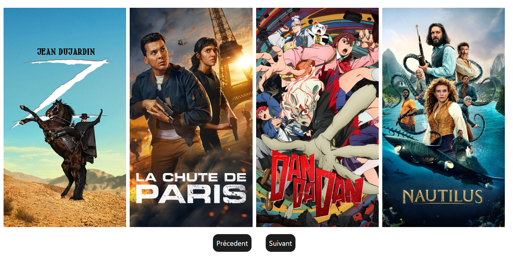

# 🖋️ Previously-on - Gérez votre wishlist de séries actuelles

**Previously-on** est un site web conçu afin de vous permettre de gérer votre wishlist sur les séries, mais également d'avoir un suivi des épisodes vus sur une série. Ce projet est développé avec **React.js** pour la rapidité et l'efficacité du rendu côté serveur, Tailwind pour le design côté client et utilise **Node.js** pour gérer les interractions en back.



## 🖥️ Aperçu du projet

Previously-on aide les utilisateurs à :
- Avoir un suivi de leur compte BetaSeries via cette interface web.
- Avoir un suivi de leurs séries (épisodes vus / à voir).
- Découvrir les séries actuelles en tendance.
- Permettre d'écrire un commentaire directement sur le site.

## 📂 Structure du projet

Le projet contient les principaux dossiers suivants :

- `client/` : contient l'ensemble du front du projet.
- `server/` : contient l'ensemble du back du projet.
- `public/` : ressources statiques, y compris les images et icônes.

## 🚀 Installation et lancement

1. **Clonez le dépôt** :
    Il vous faut lancer le back avant le back :

   ```bash
   cd /server
   npm i
   node server.js
   ```

   Une fois cela effectué, vous pouvez lancer le front :

      ```bash
   cd /client
   npm i
   npm run start
   ```